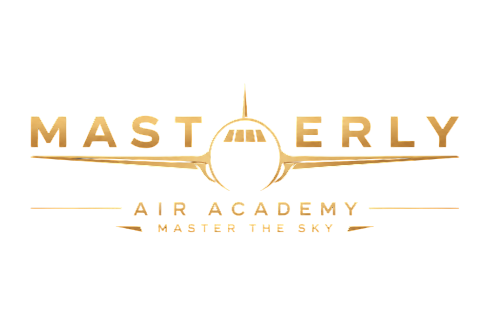

<p align="center">
  
</p>

<h1 align="center">Masterly Air Academy</h1>
<h3 align="center">Approved Training Organization — Management Platform</h3>

<p align="center">
  
  
  
  
  
</p>

---

## 🛩️ Overview

Masterly Air Academy is a complete **flight school management system** built for Approved Training Organizations (ATOs). It provides dedicated portals for every role — administrators, director general, finance, quality & safety, instructors, students, and candidates — covering the full training lifecycle from application to license issuance.

## 🏗️ Architecture

```
┌──────────────────────────────────────────────────────────────┐
│                    Nginx Reverse Proxy (:7788)                │
├──────────────────────┬───────────────────────────────────────┤
│  Next.js 15 Frontend │       Django REST API (:8000)         │
│  React 19 / TS       │       Python 3.13 + DRF + JWT         │
│  Tailwind + Recharts │       Gunicorn (4 workers)            │
├──────────────────────┴───────────────────────────────────────┤
│   PostgreSQL 17  │  Redis 8  │  MinIO  │  Meilisearch  │
│   (Primary DB)   │  (Cache)  │  (Files) │  (Search)    │
└──────────────────────────────────────────────────────────────┘
```

## 🚪 Portals

| Portal | URL | Who Uses It |
|---|---|---|
| 🔧 **Administration** | `/admin/dashboard` | System admins, staff |
| 📊 **Director** | `/director/dashboard` | Director General |
| 💰 **Finance** | `/finance/dashboard` | Finance managers, accountants |
| 🛡️ **Quality & Safety** | `/quality/dashboard` | Quality, compliance, safety managers |
| ✈️ **Instructor** | `/instructor/dashboard` | Flight & ground instructors |
| 🎓 **Student** | `/student/dashboard` | Enrolled students |
| 📝 **Candidate** | (via login) | Applicants |

## ✨ Features

### 🔧 Administration
- **User management** — Create, edit, suspend, delete users with 19 role types
- **Granular permissions** — 98 permissions across 20 domains with toggle UI
- **Student lifecycle** — Full enrollment tracking: active → suspended → archived
- **Fleet management** — Aircraft inventory, maintenance history, hours tracking, smart scheduling
- **Invoicing** — Auto-numbered, multi-currency, payment recording, status auto-update
- **Contracts** — Template-based PDF generation with digital signing
- **Documents** — S3-backed storage with type/category organization
- **Simulators & rooms** — Resource tracking with tag-based equipment lists
- **Exams & certificates** — Question banks, exam configuration, certificate issuance
- **Audit logs** — Complete activity trail with old→new change diffs
- **System settings** — Category-grouped key-value configuration, edit-in-place
- **Database backup** — One-click manual backup with status indicator
- **Broadcast** — Send notifications to specific roles or all users
- **Export engine** — Excel + PDF exports for all data domains

### 📊 Director General
- **KPI dashboard** — Students, courses, aircraft, revenue, outstanding amounts
- **Fleet utilization** — Per-aircraft and per-instructor horizontal bar charts
- **Operational alerts** — Maintenance, inactive staff, upcoming deadlines
- **Financial overview** — Revenue vs outstanding pie and bar charts
- **One-click Excel exports** — Students, invoices, flights

### 💰 Finance
- **Invoice lifecycle** — Draft → Issued → Partially Paid → Paid / Overdue
- **Payment tracking** — Full history with method, reference, date
- **Contract management** — Generate and download PDF contracts
- **Financial reports** — Status distribution and revenue charts

### 🛡️ Quality & Safety
- **Audit management** — Schedule, execute with interactive checklists, PDF reports
- **NCR tracking** — Non-conformities with severity badges and root cause analysis
- **CAPA system** — Corrective/preventive actions linked to NCRs
- **Risk matrix** — 5×5 probability/severity grid with clickable cells
- **Safety lifecycle** — Report → Investigate → Analyze → Resolve → Close
- **Deadline monitor** — Color-coded days-remaining

### ✈️ Instructor
- **Smart flight scheduling** — Shows only qualified aircraft; greyed-out with reasons
- **Conflict detection** — Overlapping lessons, instructor rest, maintenance checks
- **Prep system** — Pre-flight checklist, green checkmark when done
- **Flight evaluation** — Grade, result, competencies, pedagogical notes
- **Course & attendance** — Schedule courses, mark attendance, PDF reports
- **Module content** — Create/edit/delete lessons with Markdown + video embedding
- **Messaging** — Compose, reply, mark-as-read with unread badge

### 🎓 Student
- **Course viewer** — Full Markdown lessons with embedded video player
- **Exam system** — Anti-cheat tab-switch detection, instant scoring
- **Flight logbook** — Complete history with downloadable PDF
- **Financial overview** — Own invoices and payment history
- **Documents & certificates** — Download assigned materials and earned certs
- **Messaging** — Communicate with instructors and staff

## 🚀 Quick Start

### Prerequisites
- Docker & Docker Compose
- 4GB+ RAM available

### Installation

```bash
git clone https://github.com/DzKriMo/Masterly-Air-Academy.git
cd masterly-air-academy

# Start all 8 services
docker compose up -d

# Run migrations
docker compose exec api python manage.py migrate

# Seed roles, permissions, and demo data
docker compose exec api python manage.py seed_roles_permissions
docker compose exec api python manage.py seed_demo_data
```

Open `http://localhost:7788`.

## 🔑 Default Test Accounts

| Email | Password | Role |
|---|---|---|
| `admin@masterly-air-academy.dz` | `Admin@2026` | System Administrator |
| `director@masterly-air-academy.dz` | `director123` | Director General |
| `finance@masterly-air-academy.dz` | `finance123` | Finance Responsible |
| `quality@masterly-air-academy.dz` | `quality123` | Quality Manager |
| `fi@masterly-air-academy.dz` | `instructor123` | Flight Instructor |
| `gi@masterly-air-academy.dz` | `instructor123` | Ground Instructor |
| `ahmed@student.maa.dz` | `student123` | Student (PPL) |

Full list: 18 accounts covering all 19 roles are seeded. Complete credentials in the User Guide.

## 🛠️ Tech Stack

| Layer | Technology |
|---|---|
| **Backend Framework** | Django 5.1 + Django REST Framework |
| **Auth** | SimpleJWT with token rotation + blacklisting |
| **Frontend** | Next.js 15 (App Router) + React 19 + TypeScript |
| **Styling** | Tailwind CSS — custom navy/gold design system |
| **Charts** | Recharts (pie, bar, responsive containers) |
| **Database** | PostgreSQL 17 |
| **Cache / Queue** | Redis 8 + Celery |
| **File Storage** | MinIO (S3-compatible) |
| **Search** | Meilisearch |
| **PDF** | WeasyPrint (reports, invoices, certificates, contracts) |
| **Proxy** | Nginx |
| **Infrastructure** | Docker Compose (8 services) |

## 📁 Project Structure

```
masterly-air-academy/
├── backend/
│   ├── config/            # Django settings, URLs, WSGI
│   └── apps/
│       ├── accounts/       # User model, permissions, JWT
│       ├── students/       # Student & instructor profiles
│       ├── flight_training/# Aircraft, flights, simulators
│       ├── ground_training/# Courses, modules, lessons
│       ├── administration/ # Invoices, payments, contracts
│       ├── quality_safety/ # Audits, NCRs, CAPAs, risk
│       ├── exams/          # Exams, certificates
│       ├── notifications/  # Notifications & messaging
│       └── core/           # Audit logs, system settings
├── web/app-single/
│   ├── app/                # 65+ pages across 7 portals
│   ├── components/         # Shared UI components
│   └── lib/                # API client, auth, translations
├── nginx/                  # Nginx configuration
├── docker-compose.yml
└── README.md
```

## 🌐 Languages

The platform supports three languages with full RTL support:
- 🇬🇧 English
- 🇫🇷 French
- 🇸🇦 Arabic

## 📖 Documentation

- **User Guide** — Comprehensive PDF manual covering every feature for every role, with screenshot placeholders. Located at `masterly-air-academy-docs/user-guide.tex` (compile with `pdflatex`).
- **API Browser** — Django REST Framework browsable API at `/api/` when `DEBUG=True`.

## 📄 License

Proprietary — Masterly Air Academy. All rights reserved.

---

<p align="center">
  <sub>Built for aviation training excellence ✈️</sub>
</p>
